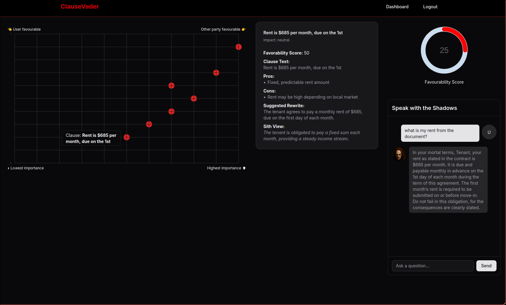

# ⚖️ ClauseVader – The Sith-Lord Contract Analyzer


ClauseVader is an AI-powered legal analysis tool that merges the power of GPT-4 with the mystique of the dark side. Upload any `.pdf` or `.docx` contract, and ClauseVader will break it down into understandable clauses, evaluate its risks and fairness, and even let you chat with your very own Sith Lord legal assistant.
Explore ClauseVader in action:
👉 https://clausevader.vercel.app/
> “You may upload the agreement… but it does not favor you.” – ClauseVader

---

## Problem Statement
Legal contracts are often written in complex, technical language that makes them difficult for non-lawyers to understand. Individuals and small businesses frequently sign agreements without fully grasping the implications of each clause—leading to unfavorable terms, hidden risks, and costly misunderstandings.

There is a lack of accessible tools that can:

* Break down contract language into simple, understandable summaries,
* Evaluate clauses for fairness and legal risk, and
* Allow users to engage interactively with their contracts to clarify concerns.

Traditional legal review is expensive, slow, and inaccessible to many. In a world where agreements are signed daily—leases, NDAs, partnerships, terms of service—there is an urgent need for an intelligent, user-friendly system that makes legal documents transparent and comprehensible.

---

## Hackathon Info
Track: Full Stack

Challenges completed:
- Challenge 1: Colour Theme
  - Our colour theme is set as black and red (dark mode) to match the Sith vibes
- Challenge 2: Easter Egg
  - Our landing page includes a 3D animation that's also an easter egg to the Star Wars crawl intro
- Challenge 4: 3D Animation
  - Our landing page includes a 3D animation intro

---

## 🚀 Features

- 📄 **File Upload Support**: Upload `.pdf` or `.docx` contracts.
- 🧠 **AI-Powered Clause Extraction**:
  - Summarizes each clause in simple terms.
  - Gives pros and cons from the user’s perspective.
  - Scores each clause by:
    - `x`: fairness (user vs. issuer)
    - `y`: risk level (low vs. high)
- 📊 **Visual Clause Mapping**: Clauses plotted on a graph based on risk & fairness.
- 💬 **Live Chat with ClauseVader**: Streamed GPT-4 responses, in the voice of a dark Sith Lord.
- 🔐 **User-Based Document Storage**: View, chat, and revisit previous uploads and analysis.

---

## 🛠 Tech Stack

### 🔹 Frontend (Deployed on [Vercel](https://vercel.com))
- **[Next.js](https://nextjs.org/)** – React-based frontend framework
- **[Tailwind CSS](https://tailwindcss.com/)** – Utility-first styling
- HTML / CSS / JavaScript for UI flexibility
- Communicates with backend via REST API

### 🔸 Backend (Deployed on [Railway](https://railway.app))
- **[FastAPI](https://fastapi.tiangolo.com/)** – Python web framework for blazing-fast APIs
- **[SQLAlchemy](https://www.sqlalchemy.org/)** – ORM for PostgreSQL
- **[PostgreSQL (NeonDB)](https://neon.tech/)** – Scalable cloud-hosted database
- **[Uvicorn](https://www.uvicorn.org/)** – ASGI server for FastAPI
- **[OpenAI GPT-4](https://platform.openai.com/)** – Handles all clause analysis and chat

---

## 📦 Backend Setup (FastAPI)

### 1. Clone the Repository

```bash
git clone https://github.com/your-username/clausevader.git
cd clausevader/backend
python -m venv venv
source venv/bin/activate     # On Windows: venv\Scripts\activate
pip install -r requirements.txt
